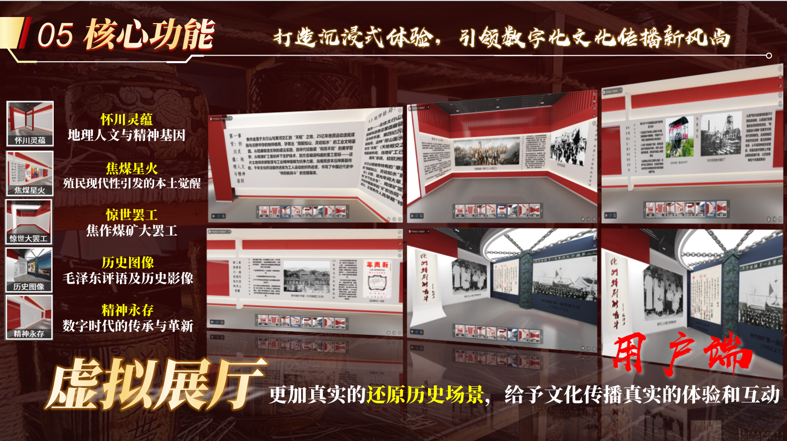
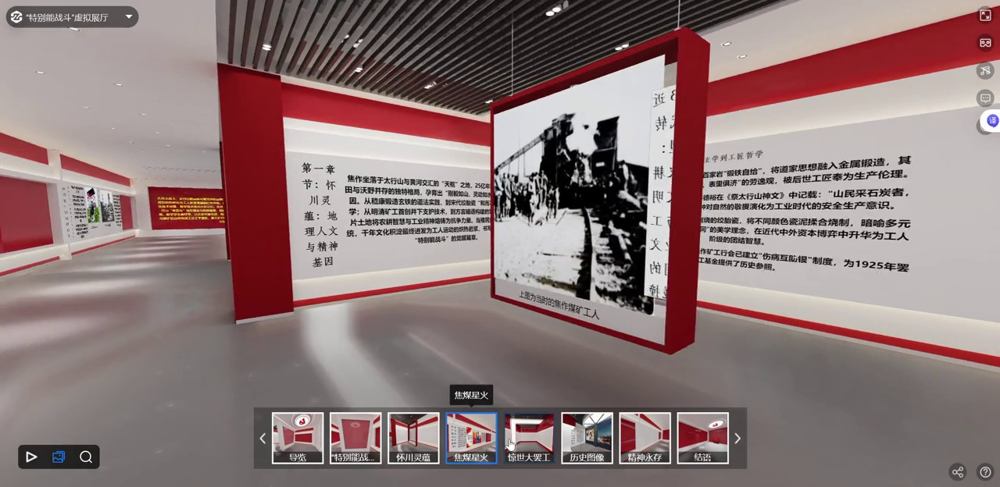

# 项目与材料整理说明

智火星传围绕红色文化学习、知识测评、虚拟展厅、实践投稿和交流场景组织内容。历史材料以焦作煤矿工人大罢工、“特别能战斗”精神及相关工业文化资源为主题，尝试将知识浏览、互动测评和实践成果放到一个线上平台中。

源码使用 Vue 3、TypeScript、Vite、Element Plus 和 Spring Boot，并基于芋道框架扩展文章、分类、标签、评论、点赞、实践内容和群聊功能。测评后有基础建议与 AI 建议接入层；公开版本需要使用者自行配置服务端模型代理。

## 展厅展示

上图来自项目 PPT，展示当时接入的线上展厅。展厅为外部场景集成；本仓库不将其描述为自行实现的三维渲染引擎，也没有附带该外部场景的全部资源或部署授权。

演示裁去了浏览器与账号区域，并移除了音轨。历史展品、照片和相关商标仍归原权利人所有。展示片段不授予独立素材再许可。

## 资料范围

此文档依据项目说明、源码与比赛材料整理。原始材料中的团队资料、个人联系方式、账号、服务器地址及未经验证的宣传指标未直接搬入 README。获奖名称和级别见 [AWARDS.md](AWARDS.md)，运行条件见 [CONFIGURATION.md](CONFIGURATION.md)。
